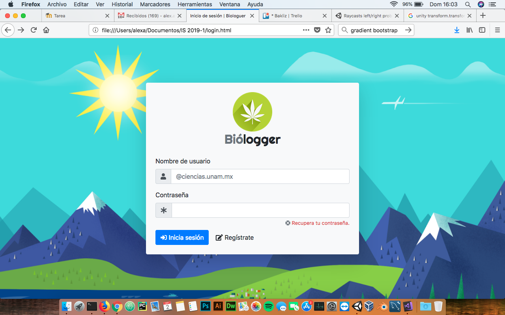

## Biologger < Branch Alex Aldaco >

#### Ingenieria de Software

------------

- Chávez Muñoa Ian Eduardo
- Cortez Flores Luis Enrique
- Lissarrague Berumen Iker
- Vargas Aldaco Alejandro Emmanuel

------------

#### Demo

Da click en la imagen para ver el video

#### Intrucciones

1. Para descargar el branch  
`git clone -b alex-iteracion2 --single-branch https://github.com/sraldaco/Biologger.git`

2. Crear la base de datos en postgresql en Mac o Linux (Busquen la versión alternativa para estos comandos en Windows) 
`sudo -u postgres -i` 
`createdb Biologger` 
`cd /path/to/this/proyect` 
`psql -b Biologger -f Biologger-2da-iteracion.sql` 
`exit`

3. Configurar el archivo persistence.xml 
`cd Biologger` 
`nano src/main/resources/META-INF/persistence.xml` 
Hay que cambiar el password y el user, según como tengas configurado postgresql, en estas dos líneas: 
`<property name="javax.persistence.jdbc.user" value="postgres"/>` 
`<property name="javax.persistence.jdbc.password" value="ElPassword!"/>`

4. Para el envio de correos debes ingresar una cuenta de correo con una conexión smtp y lo puedes configurar en el archivo `src/main/webapp/WEB-INF/classes/correo.properties.`
Si usas una cuenta de gmail (o @ciencias.unam.mx), asegurate que permita el envio de correos desde aplicaciones menos seguras -- Busca en google cómo se hace --

	*Ejemplo:*

    	correo = alex.aldaco@khronostelecom.mx
    	remitente = Alex Aldaco
    	usuario = alex.aldaco
    	contrasena = password
    	host = mail.khronostelecom.mx
    	puerto = 587

5. Ya que tengas todo configurado limpias la aplicacions y haces un deploy 
`mvn clean install`

6. Luego corre la aplicación con el siguiente comando 
`mvn tomcat7:run`

7. Para visializar el index de la aplicación entra por la siguiente ruta en tu navegador 
`http://localhost:8080/Biologger/faces/index.xhtml`

8. Para expirar o vencer los pedidos, basta con agregar una tarea cron al sistema, en este caso se configura la tarea para que se ejecute cada hora.

	Primero en la terminal 
	`crontab -e`

	Pegamos el siguente comando (Edita la url si no es la que usa el proyecto) 
	`0 * * * * wget -O - -q -t 1 http://localhost:8080/Biologger/faces/cron.xhtml`

	Cerramos y guardamos

9. Los datos de inicio de sesión del administrador por defecto son: 
			`usuario: admin`
			`contraseña: 123`

## ¡Importante!

Esta aplicación requiere de tomcat 8.5 como mínimo para su correcto funcionamiento. Se ha detectado que cuando se ejecuta con el plugin de maven tomcat7, la subida de imágenes lanza una excepción.

Para usar esta aplicación con tomcat 8, es necesario tenerlo descargado y hacer un enlace simbólico hacia la carpeta Biologger (que está dentro de la carpeta target) dentro de la carpeta webapps de tomcat 8.
